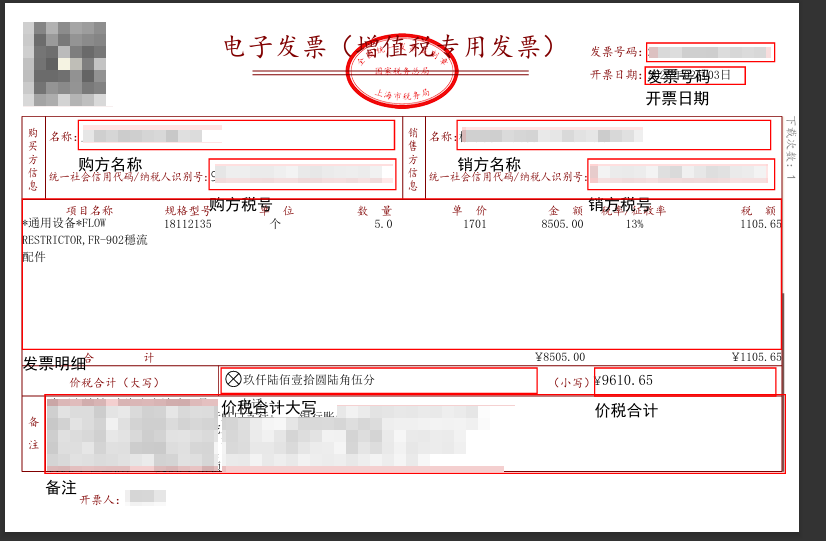

# pdf-invoice-extract-cn
提取中文电子发票内容，基于itext从pdf中提取文字
注：非完整项目，仅提供一组可用的坐标及提取方式，未进行优化。提取方式仅供参考。具体使用请自行修改即可

1.识别区域标识

2.按已定义标签提取
3.自行设定区域范围及提取内容

PdfInvoiceProcessor reader = new PdfInvoiceProcessor(@"C:\Temp\xxxx.pdf");
//pdf上标识区域   保存到原文件目录的文件名+"_marked.pdf"中
reader.MarkTemplateArea();
//读取标识区域内的文本内容
logger.Info(reader.ReadTextByArea(reader.tagPositionDict.发票号码));
logger.Info(reader.ReadTextByArea(reader.tagPositionDict.备注));